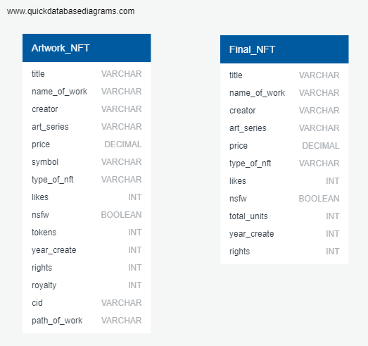
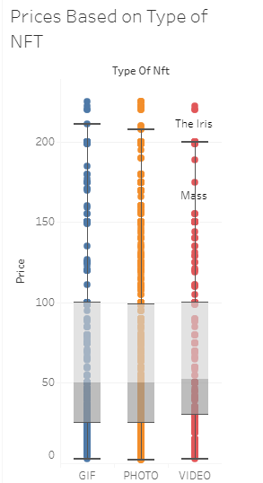
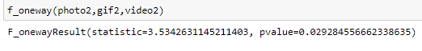

# Data Analytics Bootcamp Final Project

| Team Info |  |
| --------- | ------------------- |
| Team Name | Digital Data Divers |
| Team Number | 4 |
| Team Member 1 | [Ariela Ortiz](www.github.com/aoritz224) |
| Team Member 2 | [Jonathan Lozano](www.github.com/jlozano1990) |
| Team Member 3 | [Yaser Kassam](www.github.com/yaserkassam) |
| Team Member 4 | [David Adams](www.github.com/davidatoms) |
| Teacher's Asssistant | [Mayur Amrutiya](www.github.com/mayuramrutiya) |

## Project General Topic: 
Non-Fungible tokens (NFTs)
## Project Title: 
NFTs as Art
## Project Questions: 

|Responsible Team Member|Questions to Analyze|
|-----------------------|--------------------|
|Yaser|Does the type of art NFT (Photo, GIF, Video) affect its price?|
|Ariela|How NSFW content influences the price? *(Resources: Supervised Machine Learning in Jupyter Notebook)*|
|Jonathan|Is there a relationship between an NFTs age and the price of the NFT?|
|     |Is novelty or innovation driving the blockchain craze? Are NFTs a case for intellectual property or just another digital fad? How vertical can a horizontal innovation travel?|

## Project Proposal: 
Growing Industry with a Future or Current Sensation?
## Project Management Method: 
Individual Remote Branches, Slack, Google Slides and Github Readme
## Project Communication: 
Slack under the private channel fp-team-4, Github

## Data Sources:

[Kaggle Dataset](http://www.kaggle.com/vepnar/nft-art-dataset)
## Data Size: 
1MB
## Number of Datasets/Tables: 
1 Dataset
## Number of Rows: 
4118
## Number of Columns:
15
## Column Names, Descriptions, and Data Types:
### Column Names:
title, name, creator, art_series,price, symbol, type, likes, nsfw, tokens, year, rights, royalty, cid, path
### Descriptions:
Title of the art piece, Name of the art piece, Creator of the art piece,  Name of the collection the art piece is a part of, Price of the art piece in the given symbol, Currency the art piece is sold in, Type of art, Amount of likes the art piece got, Label if the art piece is safe for work(Example of not safe for work are sexual art pieces), Amount of art pieces for sale, Year the author created the art piece, 1=Private 3=Limited production, Unused, IPFS Hash, Path to the art piece
### Data Types:
String, String, String, String, Integer, String, String, Integer, Boolean, Integer, Integer, Integer, Integer, String, String
## Missing Data Issues: N/A
## Plan to Resolve Missing Data Issues: N/A

## Data Processing Plans
1. Read the data
2. Clean the data - drop "symbol", drop "cid", drop "royalty",drop "path_of_work", clean "year" (1998 - 2021), change columns to more user-friendly format
3. Use Postgres and Pandas

## Database Plans
- Structured
- Database schema / mockup

With the Kaggle database that we have we created a schema for a database called Artwork_NFT. With our schema loaded we changed column names, so they were more understandable. Such as tokens, which were the total units of art pieces being sold into total units. Next, we dropped columns that through our initial transformation we identified as not holding value such as symbol which was where the NFT was sold; because the dataset comes from Swap.Hive the column is listed with one value Swap.Hive. Next, we decided to filter the years between 1998-2021. Some years that were entered were years that had not happened like 2158 or from look as if they were entered incorrectly like 1. This we believed would affect our results in each of our questions. After extracting the data and transforming it to where we can individually explore the dataset, we created a final database named Final_NFT.

## Data Analysis Plans
### EDA (Exploratory Data Analysis)
#### Yaser
##### Does the type of NFT effect the price?
The first question that we have was to see if the type of NFT effects the price of the NFT. The first step was to upload the database and to look at the columns that were relevant to this question. From the Final_NFT Database a new pandas dataframe was created from the type_of_nft column and the price column. Initially looking at all the prices there were many outliers. After, filtering the outliers a box and whisker plot was created to see if visually we can see a difference between the 3 types of NFTs (GIF, Video, Photo). As you can see below there looks like there may be a significance in video, but the graphs were very similar.

To verify if there is a significance that the price is affected by the type of NFT using a one-way anova, we can see that the p-value is .0298. This tells us that there is significance between the relationship of price and the type of nft.

## Machine Learning Plans

Using machine learning we tried to create a model that can predict the price if a new NFT was created. We created a new column named age to give an age to each NFT from the year_create column. We also, created a new column price_log10 that uses np.log10 to convert the price column because of the high variances between the prices and it scales the data.

- First, we identified our x variables as: type of nft, likes, nsfw, total units, age, rights, and creator.
- Second, the y value that we are trying to predict is the price_log10.

With the data split into our variables, we split the data, used StandardScaler to scale the data and fit it into 3 different models (Multiple Linear Regression, Decision Tree Regressor, Random Forest Regressor). After adjusting each of the models we came with the result that the Random Forest Regressor gave us the best score of 41.5%.

|Type of Model| Model Score|
|-------------|------------|
|Multiple Linear Regression|6.6 %|
|Decision Tree|10.2 %|
|Random Forest|41.5 %|

## Data Visualizations
Software: Tableau Public 2021.1

[NFT Tableau Story](https://public.tableau.com/views/NFTs_Artwork_Analysis_16211277688470/NFTStory?:language=en&:display_count=y&publish=yes&:origin=viz_share_link)
- Box Plot of type of NFT as it related to Price
- Bar Chart of Age of NFT as it relates to Price
- Bar Chart of NSFW content sensitivity to Price 

## Presentation
[Google Slides](https://docs.google.com/presentation/d/1rfDBABNm2Aaknv26U_QnbfN1EjrS2tjRFv6WStWSxDk/edit#slide=id.p)
- THIS Github
- Powerpoint presentation (google slides or powerpoint)
- Report
